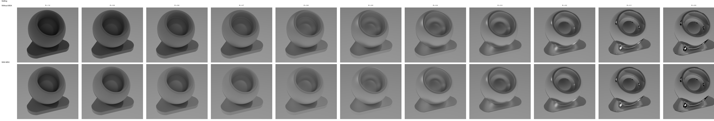
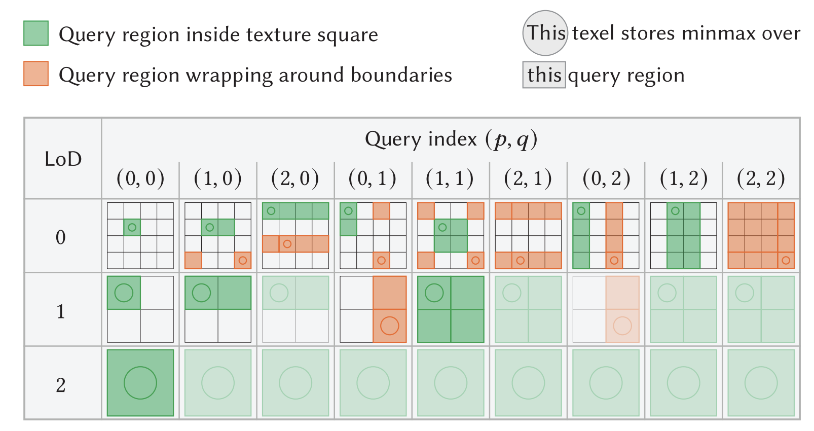

# MatForge - Advanced Material Rendering System

<div align="center">


**A Production-Quality GPU Path Tracer Implementing Four Complementary SIGGRAPH Papers**

[](https://www.cis.upenn.edu/~cis5650/)
[](https://cis5650-fall-2024.github.io/)
[](https://www.vulkan.org/)
[](https://shader-slang.com/)

[Features](#features) • [Quick Start](#quick-start) • [Papers](#papers-implemented) • [Team](#team) • [Documentation](#documentation)

</div>

---

## Overview

**MatForge** is an advanced material rendering system developed for CIS 5650 GPU Programming at the University of Pennsylvania. The project implements **four complementary SIGGRAPH papers (2023-2024)** in a unified Vulkan-based path tracing pipeline, demonstrating state-of-the-art techniques for Monte Carlo sampling, displacement mapping, and physically-based material rendering.

### Pipeline Architecture

```
┌─────────────────────────────────────────────────────────────┐
│             MatForge Rendering Pipeline                     │
├─────────────────────────────────────────────────────────────┤
│                                                             │
│  1. QUAD-OPTIMIZED LDS - Sampling Foundation                │
│     └─ Generate low-discrepancy random numbers              │
│        ↓                                                    │
│  2. RMIP - Geometry Detail                                  │
│     └─ Ray-trace displacement maps directly (WIP)           │
│        ↓                                                    │
│  3. BOUNDED VNDF - Direction Sampling (Planned)             │
│     └─ Efficient importance sampling                        │
│        ↓                                                    │
│  4. FAST-MSX - BRDF Evaluation                              │
│     └─ Multiple scattering approximation                    │
│        ↓                                                    │
│  5. MONTE CARLO INTEGRATION                                 │
│     └─ Combine: f(ωᵢ, ωₒ) × L(ωₒ) × cos(θ) / PDF            │
│                                                             │
└─────────────────────────────────────────────────────────────┘
```

---

## Features

### ✅ Implemented (Milestone 1)

#### 🎲 Quad-Optimized Low-Discrepancy Sequences (QOLDS)

- **Paper**: "Quad-Optimized Low-Discrepancy Sequences" (SIGGRAPH 2024)
- **Implementation**: Complete host + device integration
- Base-3 Sobol' sequence generator with irreducible polynomials
- Owen scrambling for randomization
- 47 dimensions × 243 max points (3^5)
- Real-time toggle between QOLDS and PCG sampling
- **Expected Benefits**: 15-30% variance reduction in Monte Carlo rendering

#### ⚡ Fast-MSX (Fast Multiple Scattering Approximation)

- **Paper**: "Fast Multiple Scattering Approximation" (SIGGRAPH 2023)
- **Implementation**: BRDF evaluation with multi-scatter term
- Relaxed V-cavity model for GGX materials
- Modified geometry term (G_I) and distribution (D_I)
- Fresnel squared (F²) for multi-bounce energy
- Real-time toggle for comparison
- **Expected Benefits**: 100× better energy conservation at high roughness

### 🚧 In Progress (Milestone 2 - Nov 24)

#### 🏔️ RMIP (Rectangular MinMax Image Pyramid)

- **Paper**: "Displacement ray-tracing via inversion and oblong bounding" (SIGGRAPH Asia 2023)
- **Status**: GPU compute pipeline operational, intersection shader in progress
- Hierarchical min-max pyramid for displacement maps
- ~5ms build time for 4K textures
- **Expected Benefits**: 11× faster than tessellation, 3× less memory

#### 🎯 Bounded VNDF (Planned)

- **Paper**: "Bounded VNDF Sampling for Smith-GGX Reflections" (SIGGRAPH Asia 2023)
- **Status**: Foundation planned
- Tighter spherical cap bounds for importance sampling
- **Expected Benefits**: 15-40% fewer rejected samples for rough surfaces

### 🛠️ Base Framework

Built on [NVIDIA nvpro-samples/vk_gltf_renderer](https://github.com/nvpro-samples/vk_gltf_renderer):

- **Graphics API**: Vulkan 1.3 with ray tracing extensions
- **Shader Language**: Slang with hot-reload support (F5)
- **Framework**: nvpro-core2 (NVIDIA Professional Graphics)
- **Path Tracer**: Adaptive sampling, MIS, optional DLSS-RR denoiser
- **Rasterizer**: PBR-based with HDR environment mapping
- **glTF 2.0**: Full scene loading support (.gltf/.glb)

---

## Quick Start

### Prerequisites

- **Vulkan SDK** 1.3 or later ([Download](https://vulkan.lunarg.com/sdk/home))
- **CMake** 3.20 or later
- **C++20 Compiler**:
  - Windows: Visual Studio 2022
  - Linux: GCC 11+ or Clang 14+
- **NVIDIA GPU**: RTX 20-series or newer (for ray tracing)
- **Git** with LFS support

### Build Instructions

```bash
# Clone the repository
git clone --recursive https://github.com/MatForge/MatForge.git
cd MatForge

# Configure with CMake
cmake -B build -S . -DUSE_DLSS=ON

# Build (Windows)
cmake --build build --config Release

# Build (Linux)
cmake --build build -- -j$(nproc)

# Run
./_bin/Release/MatForge
```

### First Run

1. The application will load the default shader ball scene
2. Press **F5** to reload shaders (hot-reload)
3. Use the GUI to toggle between rendering techniques:
   - **Use QOLDS**: Switch between QOLDS and PCG sampling
   - **Use FastMSX**: Toggle Fast-MSX multi-scatter evaluation
4. Load custom models: File → Open Scene (supports .gltf/.glb)
5. Load HDR environments: File → Open HDR

### Console Output

```
Creating Vulkan Context                -> 112.3 ms
Scene Loading                          -> 1.2 ms
[QOLDS] Loaded initialization data for 47 dimensions
[QOLDS] Built 47 matrices of size 5x5 (max 243 points)
[QOLDS] Generated 47 scrambling seeds
QOLDS buffers created: 47 dimensions, 243 max points
Path tracer initialized with PCG (default) sampling
```

**Toggle Messages**:

```
Switched to QOLDS sampling (Quad-Optimized Low-Discrepancy Sequences)
Switched to FastMSX (Fast Multiple Scattering)
```

---

## Papers Implemented

### 1. Quad-Optimized Low-Discrepancy Sequences

**Authors**: Victor Ostromoukhov et al.
**Published**: ACM SIGGRAPH 2024
**Location**: [doc/papers/quad-optimized-sequence.pdf](doc/papers/quad-optimized-sequence.pdf)
**Reference**: [others/QOLDS](others/QOLDS)

**What It Does**: Generates low-discrepancy sequences optimized for 2×2 pixel blocks (GPU quads), providing better space-filling properties than standard Sobol' sequences for Monte Carlo rendering.

**Key Innovation**: Base-3 Sobol' with (1,4)-sequence property + Owen scrambling

**Implementation**:

- Host-side: Generator matrix construction (`src/qolds_builder.cpp/hpp`)
- Device-side: GPU sampling function (`shaders/qolds_sampling.h.slang`)
- Integration: Path tracer with dimension tracking
- **Status**: ✅ Complete (400 LOC)

---

### 2. RMIP: Displacement Ray-Tracing via Inversion and Oblong Bounding

**Authors**: Théo Thonat, Iliyan Georgiev, François Beaune, Tamy Boubekeur (Adobe)
**Published**: ACM SIGGRAPH Asia 2023
**DOI**: [10.1145/3610548.3618182](https://doi.org/10.1145/3610548.3618182)
**Location**: [doc/papers/rmip.html](doc/papers/rmip.html)

**What It Does**: Enables tessellation-free displacement mapping for GPU ray tracing by ray-tracing displacement maps directly using hierarchical bounding.

**Key Innovation**: Combines inverse displacement mapping with oblong (rectangular) bounding in texture space.

**Implementation**:

- RMIP data structure builder (`src/rmip_builder.cpp/hpp`)
- GPU compute shaders (`shaders/rmip_*.compute.slang`)
- Custom intersection shader (in progress)
- **Status**: 🚧 In Progress (800 LOC planned)

---

### 3. Bounded VNDF Sampling for Smith-GGX Reflections

**Authors**: Kenta Eto & Yusuke Tokuyoshi (AMD)
**Published**: ACM SIGGRAPH Asia 2023
**DOI**: [10.1145/3610543.3626163](https://doi.org/10.1145/3610543.3626163)
**Location**: [doc/papers/bounded_VNDF.pdf](doc/papers/bounded_VNDF.pdf)

**What It Does**: Improves importance sampling for rough GGX materials by computing tighter spherical cap bounds, reducing rejected samples.

**Key Innovation**: Tighter bound `k = (1 - a²)s² / (s² + a²z²)` instead of conservative `-i_std.z`

**Implementation**:

- Will integrate into `pbr_ggx_microfacet.h.slang`
- **Status**: 📋 Planned for Milestone 2

---

### 4. Fast Multiple Scattering Approximation

**Authors**: Unknown (SIGGRAPH 2023)
**Published**: ACM SIGGRAPH 2023
**Location**: [doc/papers/msx.pdf](doc/papers/msx.pdf)

**What It Does**: Adds a multi-scatter term to single-scatter GGX BRDF, improving energy conservation at high roughness with minimal overhead.

**Key Innovation**: Relaxed V-cavity model with modified distribution `D_I` and geometry term `G_I`

**Implementation**:

- BRDF evaluation (`shaders/fast_msx.h.slang`)
- Integration into path tracer with toggle
- **Status**: ✅ Complete (350 LOC)

---

## Project Structure

```
MatForge/
├── src/                          # C++ source code
│   ├── qolds_builder.cpp/hpp     # QOLDS matrix generation
│   ├── rmip_builder.cpp/hpp      # RMIP data structure builder
│   ├── renderer.cpp/hpp          # Main renderer
│   └── renderer_pathtracer.cpp   # Path tracer implementation
│
├── shaders/                      # Slang shaders
│   ├── qolds_sampling.h.slang    # QOLDS GPU sampling
│   ├── fast_msx.h.slang          # Fast-MSX BRDF evaluation
│   ├── rmip_*.compute.slang      # RMIP compute shaders (WIP)
│   └── gltf_pathtrace.slang      # Main path tracing shader
│
├── resources/                    # Assets
│   ├── models/                   # glTF models
│   ├── envmaps/                  # HDR environment maps
│   └── initIrreducibleGF3.dat    # QOLDS initialization data
│
├── doc/                          # Documentation
│   ├── markdowns/                # Technical documentation
│   │   ├── QOLDS_impl_plan.md
│   │   ├── RMIP_impl_plan.md
│   │   └── MSX_VNDF_impl_plan.md
│   ├── papers/                   # Research papers
│   └── presentations/            # Milestone presentations
│
└── CLAUDE.md                     # Developer guide
```

---

## Team

**Course**: CIS 5650 GPU Programming (Fall 2025)
**Institution**: University of Pennsylvania
**Timeline**: November 3 - December 7, 2025 (5 weeks)

| Team Member       | Responsibility          | Implementation                            |
| ----------------- | ----------------------- | ----------------------------------------- |
| **Yiding**  | Quad-Optimized LDS      | Sampling foundation (✅ Complete)         |
| **Cecilia** | RMIP                    | Displacement ray tracing (🚧 In Progress) |
| **Xiaonan** | Fast-MSX + Bounded VNDF | Material system (⚡ Fast-MSX Complete)    |

---

## Documentation

### Implementation Plans

- [QOLDS Implementation Plan](doc/markdowns/QOLDS_impl_plan.md)
- [RMIP Implementation Plan](doc/markdowns/RMIP_impl_plan.md)
- [Fast-MSX + Bounded VNDF Plan](doc/markdowns/MSX_VNDF_impl_plan.md)
- [Project Plan](doc/markdowns/PROJECT_PLAN.md)

### Milestone Reports

- [Milestone 1 Report](doc/presentations/Milestone1.md) (Nov 12, 2025)
- Milestone 2 Report (Nov 24, 2025) - Coming Soon
- Final Report (Dec 7, 2025) - Coming Soon

### Developer Guide

- [CLAUDE.md](CLAUDE.md) - Comprehensive developer guide with codebase architecture

### Technical Reports

- [QOLDS Integration Report](doc/markdowns/QOLDS_report.md)
- [QOLDS GPU Implementation](doc/markdowns/QOLDS_gpu_implementation.md)

---

## Usage

### GUI Controls

**Rendering Techniques** (Path Tracer panel):

- ☑️ **Use QOLDS**: Enable Quad-Optimized Low-Discrepancy Sequences
- ☑️ **Use FastMSX**: Enable Fast Multiple Scattering (default: ON)
- ☐ **Use RMIP**: Enable displacement ray tracing (coming in Milestone 2)

**Quality Settings**:

- **Samples**: Samples per pixel (1-64)
- **Max Depth**: Maximum ray bounce depth (1-10)
- **Firefly Clamp**: Threshold for firefly reduction

**Debug Visualizations**:

- Normal mapping
- Roughness/Metallic
- Base color
- Depth

### Keyboard Shortcuts

| Key             | Action                      |
| --------------- | --------------------------- |
| **F5**    | Reload shaders (hot-reload) |
| **F1**    | Toggle UI visibility        |
| **Space** | Pause/resume rendering      |
| **R**     | Reset camera                |

### Loading Custom Content

**Models**:

```bash
./MatForge --scenefile path/to/model.gltf
```

**HDR Environments**:

```bash
./MatForge --hdrfile path/to/environment.hdr
```

**Command Line Options**:

```bash
./MatForge --help
  --scenefile <path>     Load glTF scene
  --hdrfile <path>       Load HDR environment
  --size <width> <height> Window size
  --vsync                Enable V-Sync
  --headless             Run without window (benchmarking)
  --frames <count>       Number of frames (headless mode)
```

---

## Performance

TBD

## Milestones

### ✅ Milestone 1 (Nov 12, 2025) - COMPLETE

**Goal**: Individual techniques working (foundations)

**Deliverables**:

- ✅ QOLDS: Host + device + integration (400 LOC)
- ✅ Fast-MSX: BRDF evaluation (350 LOC)
- ✅ RMIP: GPU compute pipeline (800 LOC)

**Status**: All objectives met, ahead of schedule

---

### 🚧 Milestone 2 (Nov 24, 2025) - IN PROGRESS

**Goal**: Full pipeline integration + material system

**Planned Deliverables**:

- ⏭️ RMIP custom intersection shader
- ⏭️ Bounded VNDF implementation
- ⏭️ Full pipeline test (all 4 techniques)
- ⏭️ Material library (7+ materials)
- ⏭️ Performance benchmarks
- ⏭️ Convergence analysis

---

### 📋 Milestone 3 (Dec 1, 2025) - PLANNED

**Goal**: Production features + comprehensive analysis

**Planned Deliverables**:

- Material parameter editor (ImGui)
- Side-by-side comparisons (with/without techniques)
- Comprehensive analysis (convergence, quality, performance)
- Demo video
- Final documentation

---

## Building from Source

### Windows (Visual Studio 2022)

```bash
# Configure
cmake -B build -S . -DUSE_DLSS=ON -DUSE_DRACO=ON

# Build
cmake --build build --config Release

# Run
.\_bin\Release\MatForge.exe
```

### Linux (GCC/Clang)

```bash
# Install dependencies (Ubuntu/Debian)
sudo apt-get install vulkan-sdk libglfw3-dev

# Configure
cmake -B build -S . -DCMAKE_BUILD_TYPE=Release

# Build
cmake --build build -- -j$(nproc)

# Run
./_bin/Release/MatForge
```

### Build Options

| Option                | Default | Description                       |
| --------------------- | ------- | --------------------------------- |
| `USE_DLSS`          | ON      | Enable NVIDIA DLSS-RR denoiser    |
| `USE_DRACO`         | ON      | Enable Draco mesh compression     |
| `USE_DEFAULT_SCENE` | OFF     | Embed default scene in executable |

---

## Troubleshooting

### Common Issues

**"QOLDS initialization file not found"**

```
Error: Could not open initialization file: resources/initIrreducibleGF3.dat
```

**Solution**: Ensure `resources/` directory is in the same location as the executable, or run from the project root.

**"Vulkan validation errors"**

```
Validation Error: vkCreateGraphicsPipelines: (...)
```

**Solution**: Update graphics drivers to the latest version. NVIDIA RTX 20-series or newer required.

**"Slang compilation failed"**

```
error 30047: argument passed to parameter '0' must be l-value
```

**Solution**: Press F5 to reload shaders. This issue should not occur in the current build.

**"Low FPS / Stuttering"**

- Reduce samples per pixel (try 1-4 for real-time preview)
- Lower max ray depth
- Disable DLSS if enabled
- Check GPU utilization in Task Manager

---

## Known Limitations

- RMIP intersection shader not yet complete (Milestone 2)
- Bounded VNDF not yet implemented (Milestone 2)
- Limited to 47 dimensions for QOLDS (sufficient for path tracing)
- QOLDS sequence length limited to 243 points (3^5)
- Fast-MSX works best with roughness > 0.5

---

## Contributing

This is an academic project for CIS 5650. While we appreciate feedback, we are not accepting external contributions during the course period (Nov 3 - Dec 7, 2025).

For questions or feedback:

- Open an issue on GitHub
- Contact the team via course channels

---

## License

This project is built on [nvpro-samples/vk_gltf_renderer](https://github.com/nvpro-samples/vk_gltf_renderer), which is licensed under the Apache License 2.0.

**MatForge Extensions**:

```
Copyright (c) 2025, MatForge Team (CIS 5650, University of Pennsylvania)

Licensed under the Apache License, Version 2.0 (the "License");
you may not use this file except in compliance with the License.
You may obtain a copy of the License at

    http://www.apache.org/licenses/LICENSE-2.0
```

See [LICENSE](LICENSE) for full license text.

---

## Acknowledgments

- **Professor**: Shehzan Mohammed (CIS 5650, University of Pennsylvania)
- **Base Framework**: [NVIDIA nvpro-samples](https://github.com/nvpro-samples)
- **Papers**:
  - Ostromoukhov et al. (SIGGRAPH 2024) - Quad-Optimized LDS
  - Thonat et al. (SIGGRAPH Asia 2023) - RMIP
  - Eto & Tokuyoshi (SIGGRAPH Asia 2023) - Bounded VNDF
  - Fast-MSX (SIGGRAPH 2023) - Multiple Scattering
- **Reference Implementation**: [QOLDS GitHub](https://github.com/liris-origami/Quad-Optimized-LDS)

---

## Gallery

### QOLDS Sampling


*Low-discrepancy sampling with 47 dimensions*

### Fast-MSX Comparison


*Multiple scattering approximation (left: without, right: with Fast-MSX)*

### RMIP Structure


*Hierarchical min-max pyramid for displacement maps*

---

## Citations

If you use this work in your research, please cite:

```bibtex
@misc{matforge2025,
  title={MatForge: Advanced Material Rendering System},
  author={Yiding, Cecilia, Xiaonan},
  year={2025},
  institution={University of Pennsylvania, CIS 5650},
  url={https://github.com/MatForge/MatForge}
}
```

**Papers Implemented**:

```bibtex
@inproceedings{ostromoukhov2024quad,
  title={Quad-Optimized Low-Discrepancy Sequences},
  author={Ostromoukhov, Victor and others},
  booktitle={ACM SIGGRAPH 2024},
  year={2024}
}

@inproceedings{thonat2023rmip,
  title={RMIP: Displacement ray-tracing via inversion and oblong bounding},
  author={Thonat, Théo and Georgiev, Iliyan and Beaune, François and Boubekeur, Tamy},
  booktitle={ACM SIGGRAPH Asia 2023},
  year={2023},
  doi={10.1145/3610548.3618182}
}

@inproceedings{eto2023bounded,
  title={Bounded VNDF Sampling for Smith-GGX Reflections},
  author={Eto, Kenta and Tokuyoshi, Yusuke},
  booktitle={ACM SIGGRAPH Asia 2023},
  year={2023},
  doi={10.1145/3610543.3626163}
}
```

---

<div align="center">

**MatForge** - Advanced Material Rendering System
CIS 5650 GPU Programming | University of Pennsylvania | Fall 2025

[Documentation](doc/markdowns/) • [Implementation Plans](doc/markdowns/) • [Milestone Reports](doc/presentations/)

</div>
