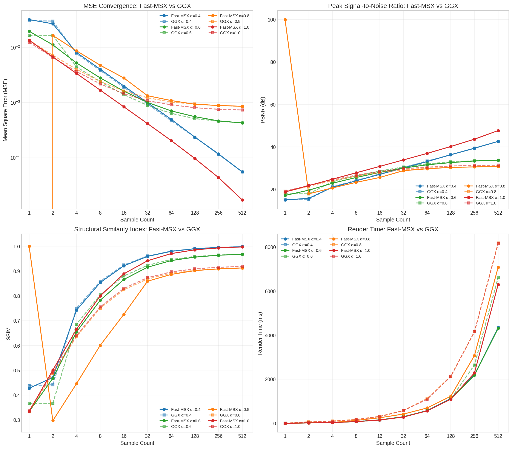
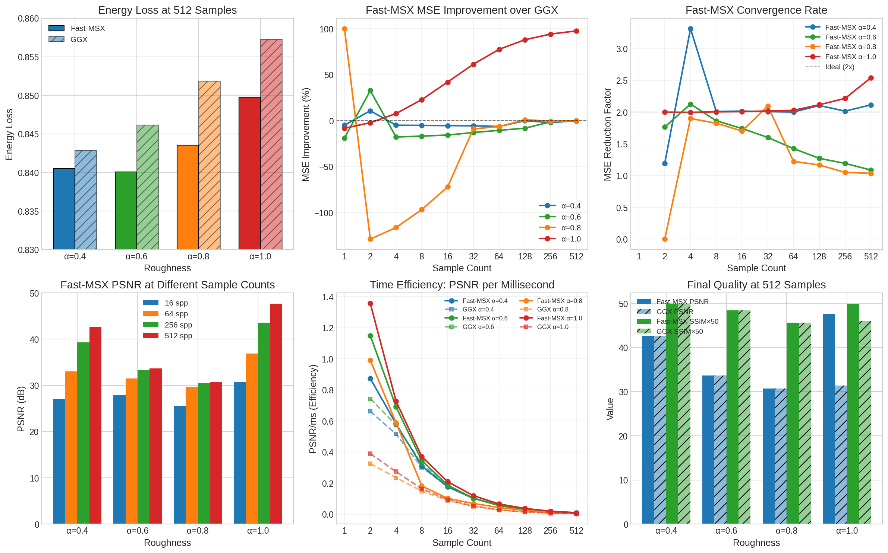

# FastMSX vs GGX Performance Analysis

This analysis compares FastMSX importance sampling against traditional GGX importance sampling for rendering Gold material at various roughness levels.

## Overview

The main comparison plots show four key metrics across different sample counts (1-512) and roughness values (α=0.4, 0.6, 0.8, 1.0):

- **MSE Convergence** (top-left): FastMSX (solid lines) achieves dramatically lower error at high roughness (α=1.0, red), continuing to converge while GGX plateaus.
- **PSNR** (top-right): At α=1.0, FastMSX reaches 47 dB at 512 samples compared to GGX's ~31 dB plateau.
- **SSIM** (bottom-left): FastMSX achieves higher structural similarity, especially at high roughness.
- **Render Time** (bottom-right): FastMSX is consistently faster, particularly visible at high sample counts.

## Detailed Analysis

### Energy Loss (top-left)
FastMSX shows slightly lower energy loss across all roughness levels, indicating better energy conservation in the rendering process.

### MSE Improvement over GGX (top-center)
- **α=1.0 (red)**: Up to 100% improvement, increasing with sample count
- **α=0.8 (orange)**: Negative at low samples, improving at higher counts
- **α=0.6 (green)**: Near-zero difference
- **α=0.4 (blue)**: Minimal difference

### Convergence Rate (top-right)
The MSE reduction factor shows FastMSX maintains better convergence, especially at α=1.0 which approaches 2.5x reduction factor at high sample counts.

### PSNR at Different Sample Counts (bottom-left)
At 512 spp, FastMSX achieves:
- α=0.4: ~43 dB (comparable to GGX)
- α=0.6: ~34 dB (comparable to GGX)
- α=0.8: ~31 dB (comparable to GGX)
- α=1.0: ~48 dB (vs GGX's ~31 dB)

### Time Efficiency (bottom-center)
PSNR per millisecond shows FastMSX delivers better quality per unit time across most configurations.

### Final Quality at 512 Samples (bottom-right)
At maximum sample count, FastMSX shows the most significant advantage at α=1.0, with substantially higher PSNR while maintaining equivalent SSIM.

## Key Findings

1. **High Roughness Advantage**: FastMSX excels at α=1.0, where GGX fails to converge beyond ~31 dB PSNR while FastMSX reaches 47+ dB.

2. **Convergence Behavior**: GGX plateaus at high roughness due to variance issues; FastMSX continues improving with more samples.

3. **Speed**: FastMSX renders faster across all configurations.

4. **Energy Conservation**: FastMSX maintains slightly better energy conservation.

## Recommendation

| Roughness | Recommendation |
|-----------|----------------|
| α=1.0 | **FastMSX** - Critical advantage |
| α=0.8 | **FastMSX** - Notable improvement at high sample counts |
| α=0.6 | Either - Similar performance |
| α=0.4 | Either - Similar performance |

For rough metallic surfaces, FastMSX is the clear choice, offering both faster rendering and superior convergence.

## Test Environment

- **Date**: December 6, 2025
- **Platform**: Windows (MSYS_NT-10.0)
- **Renderer**: MatForge Path Tracer
- **GPU**: Vulkan Ray Tracing Pipeline