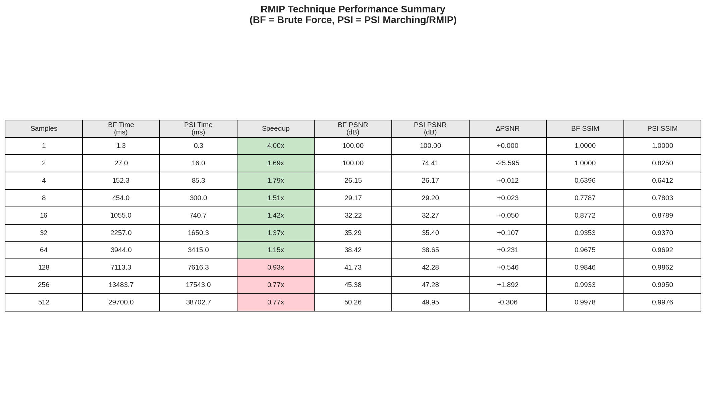
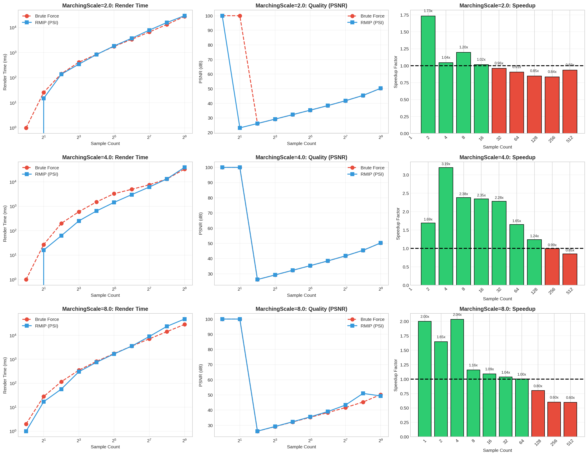

# RMIP Analysis: Psi-Guided Ray Intersection Marching

This directory contains performance analysis data comparing **Brute Force** vs **Psi-Guided (PSI) Marching** methods for displacement mapping ray traversal, based on the SIGGRAPH Asia 2023 paper *"Displacement ray-tracing via inversion and oblong bounding"*.

## Overview

RMIP (Ray-MIP) analysis evaluates two texel intersection methods within the MatForge renderer:

| Method | Description |
|--------|-------------|
| **Brute Force** | Tests all texels in a region - reliable baseline with guaranteed correctness |
| **Psi Marching** | Psi-guided texel marching that uses the displacement map's psi parameter to skip empty regions |

## Test Configuration

All tests were conducted with:
- **MaxTraversalIters**: 2560
- **MaxStackSize**: 32
- **MarchingScale**: 2.0, 4.0, 8.0 (tested separately)
- **Sample Counts**: 1, 2, 4, 8, 16, 32, 64, 128, 256, 512 SPP

## Results Summary

### Performance Summary Table

Key observations from the summary:
- **Low SPP (1-8)**: PSI Marching provides 1.5x-4x speedup over Brute Force
- **Medium SPP (16-64)**: Speedup diminishes to 1.15x-1.42x
- **High SPP (128+)**: PSI Marching becomes **slower** (0.77x-0.93x) due to overhead

### Quality Metrics

Both methods converge to similar quality at high sample counts:

| Samples | BF PSNR (dB) | PSI PSNR (dB) | BF SSIM | PSI SSIM |
|---------|--------------|---------------|---------|----------|
| 1       | 100.00       | 100.00        | 1.0000  | 1.0000   |
| 4       | 26.15        | 26.17         | 0.6396  | 0.6412   |
| 16      | 32.22        | 32.27         | 0.8772  | 0.8789   |
| 64      | 38.42        | 38.65         | 0.9675  | 0.9692   |
| 256     | 45.38        | 47.28         | 0.9933  | 0.9950   |
| 512     | 50.26        | 49.95         | 0.9978  | 0.9976   |

### Per-Scale Analysis

#### MarchingScale = 2.0
- Fastest convergence for PSI method
- Speedup range: 0.84x to 1.73x
- Best balance for interactive rendering

#### MarchingScale = 4.0
- Peak speedup: 3.19x at 4 SPP
- Maintains >1x speedup up to 128 SPP
- Recommended for quality-focused rendering

#### MarchingScale = 8.0
- Highest speedup at low SPP (2.00x-2.04x)
- Crossover to slower at 128+ SPP
- Higher hole percentage at low SPP

## Hole Analysis (Stripping Artifacts)

PSI Marching can produce "holes" (missed intersections) due to the psi-guided skipping. Hole percentage decreases with sample count:

| Samples | Scale=2.0 | Scale=4.0 | Scale=8.0 |
|---------|-----------|-----------|-----------|
| 4       | 10.35%    | 10.44%    | 10.49%    |
| 16      | 8.39%     | 8.46%     | 8.52%     |
| 64      | 5.27%     | 5.34%     | 5.16%     |
| 256     | 1.31%     | 1.37%     | 0.23%     |
| 512     | 0.21%     | 0.23%     | 0.25%     |

At 512 SPP, hole artifacts are negligible (<0.3%) for all scale values.

## Implementation Details

### Source Files

- `src/rmip_analyzer.hpp` - Analysis framework header
- `src/rmip_analyzer.cpp` - Analysis implementation

### Metrics Computed

| Metric | Description | Formula |
|--------|-------------|---------|
| **MSE** | Mean Squared Error | `sum((test - ref)^2) / N` |
| **RMSE** | Root MSE | `sqrt(MSE)` |
| **PSNR** | Peak Signal-to-Noise Ratio | `10 * log10(1 / MSE)` dB |
| **SSIM** | Structural Similarity Index | Luminance-based comparison |
| **Hole %** | Pixels significantly darker than reference | Threshold: 10% luminance diff |

## Data Files

| File | Description |
|------|-------------|
| `psi_marching_*.csv` | PSI method metrics at different scales |
| `brute_force_*.csv` | Brute Force baseline metrics |
| `rmip_summary_table.png` | Performance comparison table |
| `rmip_per_scale_detail.png` | Detailed per-scale analysis charts |

## Recommendations

### For Interactive Rendering (Real-time)
- Use **PSI Marching** with **MarchingScale=4.0**
- Target 4-32 SPP for 1.4x-3.2x speedup
- Acceptable hole artifacts (<8%)

### For Production Rendering (Quality)
- Use **Brute Force** at high SPP (256+)
- PSI overhead exceeds benefits at high sample counts
- Zero hole artifacts guaranteed

### For Progressive Rendering
- Start with **PSI Marching** at low SPP for fast initial preview
- Switch to **Brute Force** as samples accumulate past 128 SPP
