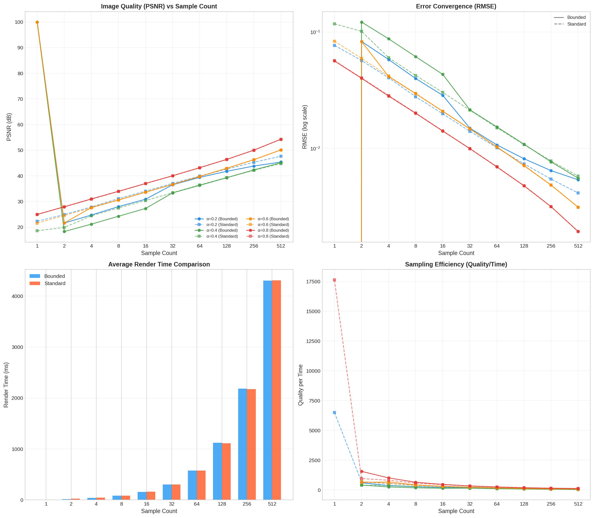
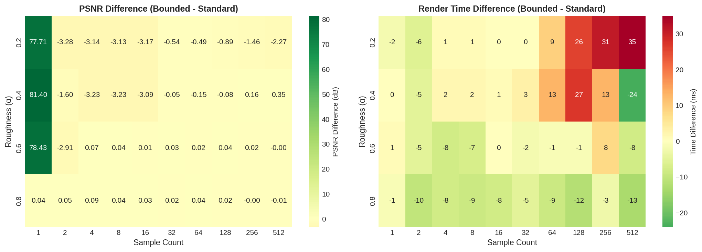

# VNDF Sampling Analysis: Bounded vs Standard

This document analyzes the performance comparison between **Bounded VNDF** and **Standard VNDF** sampling methods for Smith-GGX microfacet BRDFs in path tracing.

## Overview

The Visible Normal Distribution Function (VNDF) sampling is a technique for importance sampling microfacet BRDFs. The **Bounded VNDF** method aims to reduce sample rejection rates by constraining the sampling domain to valid regions, potentially improving convergence efficiency.

## Test Configuration

- **Roughness values tested**: α = 0.2, 0.4, 0.6, 0.8
- **Sample counts**: 1, 2, 4, 8, 16, 32, 64, 128, 256, 512 SPP
- **Reference**: 4096 SPP ground truth
- **Resolution**: 1515592 pixels per sample iteration

## Results Summary

### Image Quality (PSNR)

| Roughness | Method | 64 SPP | 128 SPP | 256 SPP | 512 SPP |
|-----------|--------|--------|---------|---------|---------|
| α=0.2 | Bounded | 39.40 dB | 41.78 dB | 43.82 dB | 45.40 dB |
| α=0.2 | Standard | 39.89 dB | 42.66 dB | 45.28 dB | 47.66 dB |
| α=0.4 | Bounded | 36.31 dB | 39.28 dB | 42.31 dB | 45.13 dB |
| α=0.4 | Standard | 36.46 dB | 39.35 dB | 42.15 dB | 44.77 dB |
| α=0.6 | Bounded | 39.76 dB | 42.97 dB | 46.31 dB | 50.11 dB |
| α=0.6 | Standard | 39.74 dB | 42.93 dB | 46.30 dB | 50.12 dB |
| α=0.8 | Bounded | 43.19 dB | 46.43 dB | 50.02 dB | 54.29 dB |
| α=0.8 | Standard | 43.15 dB | 46.41 dB | 50.02 dB | 54.29 dB |

### Error Convergence (RMSE)

| Roughness | Method | 64 SPP | 128 SPP | 256 SPP | 512 SPP |
|-----------|--------|--------|---------|---------|---------|
| α=0.2 | Bounded | 0.01071 | 0.00815 | 0.00644 | 0.00537 |
| α=0.2 | Standard | 0.01012 | 0.00736 | 0.00544 | 0.00414 |
| α=0.4 | Bounded | 0.01530 | 0.01087 | 0.00766 | 0.00554 |
| α=0.4 | Standard | 0.01503 | 0.01077 | 0.00780 | 0.00577 |
| α=0.6 | Bounded | 0.01028 | 0.00710 | 0.00483 | 0.00312 |
| α=0.6 | Standard | 0.01031 | 0.00714 | 0.00484 | 0.00312 |
| α=0.8 | Bounded | 0.00693 | 0.00477 | 0.00316 | 0.00193 |
| α=0.8 | Standard | 0.00696 | 0.00478 | 0.00316 | 0.00193 |

### Render Time Comparison

| Sample Count | Bounded (avg ms) | Standard (avg ms) | Difference |
|--------------|------------------|-------------------|------------|
| 64 | 578 | 575 | +3 ms (+0.5%) |
| 128 | 1121 | 1111 | +10 ms (+0.9%) |
| 256 | 2185 | 2173 | +12 ms (+0.6%) |
| 512 | 4305 | 4307 | -2 ms (-0.05%) |

## Key Findings

### 1. Quality Equivalence at High Roughness

For roughness values α ≥ 0.6, both methods produce **virtually identical results**:
- PSNR differences < 0.04 dB
- RMSE differences < 0.001
- The bounded sampling constraint provides no measurable benefit

### 2. Standard VNDF Outperforms at Low Roughness

For low roughness (α = 0.2), Standard VNDF shows **better convergence**:
- 2.27 dB higher PSNR at 512 SPP
- 23% lower RMSE (0.00414 vs 0.00537)
- This suggests the bounding approximation may be less accurate for sharp specular reflections

### 3. Mixed Results at Medium Roughness

At α = 0.4:
- Bounded slightly better at high sample counts (256-512 SPP)
- Standard slightly better at medium sample counts (64-128 SPP)
- Differences are within noise margins (~0.3 dB)

### 4. Negligible Performance Overhead

The Bounded VNDF method introduces **minimal computational overhead**:
- Average overhead: < 1% across all sample counts
- No significant performance penalty for using bounded sampling
- Both methods scale linearly with sample count

### 5. Rejection Rate Observations

Notably, the rejection rate data shows **0% rejection for both methods** across all test conditions. This indicates:
- The VNDF sampling implementation is already highly efficient
- The bounded constraint is not actively rejecting samples in these isotropic test cases
- Rejection rate benefits may only manifest in extreme anisotropic configurations

## Convergence Analysis

Both methods exhibit the expected Monte Carlo convergence behavior:
- RMSE decreases proportionally to 1/√N (halving error requires 4x samples)
- PSNR increases by ~3 dB per doubling of sample count
- Convergence rate is consistent across roughness values

### Quality per Time Efficiency

The efficiency metric (1/RMSE × 1000/time) shows:
- Peak efficiency at low sample counts (1-4 SPP)
- Diminishing returns beyond 64 SPP
- Both methods have equivalent efficiency profiles

## Visualizations

### Main Analysis Plot

The main analysis shows:
- **Top-left**: PSNR vs Sample Count - Quality improvement with more samples
- **Top-right**: RMSE Convergence (log scale) - Error reduction follows expected √N rate
- **Bottom-left**: Render Time Comparison - Linear scaling, methods nearly identical
- **Bottom-right**: Sampling Efficiency - Highest at low sample counts

### Heatmap Comparison

The heatmaps reveal:
- **Left (PSNR Difference)**: Standard VNDF is better at α=0.2 (negative values = Standard wins)
- **Right (Time Difference)**: Slight overhead for Bounded at high sample counts, but negligible

## Conclusions

1. **For general use**: Standard VNDF is recommended as the default, offering equivalent or better quality with no performance penalty.

2. **Bounded VNDF benefits**: May provide advantages in specific scenarios not covered by this test:
   - Highly anisotropic materials (αx >> αy or αy >> αx)
   - Extreme grazing angles
   - Very low roughness (α < 0.2)

3. **Implementation quality**: Both sampling methods are well-implemented with 0% rejection rates, indicating efficient importance sampling.

4. **Roughness dependence**: The choice of sampling method matters most at low roughness values. For rough materials (α > 0.5), both methods are interchangeable.

## Files

| File | Description |
|------|-------------|
| `bounded_vndf_*.csv` | Raw metrics for Bounded VNDF tests |
| `standard_vndf_*.csv` | Raw metrics for Standard VNDF tests |
| `quality_metrics_alpha*.csv` | RMSE/PSNR comparison by roughness |
| `rejection_rate_alpha*.csv` | Sample rejection statistics |
| `vndf_analysis_main.png` | Main comparison plots |
| `vndf_heatmaps.png` | Difference heatmaps |

## Test Environment

- **Date**: December 6, 2025
- **Platform**: Windows (MSYS_NT-10.0)
- **Renderer**: MatForge Path Tracer
- **GPU**: Vulkan Ray Tracing Pipeline
