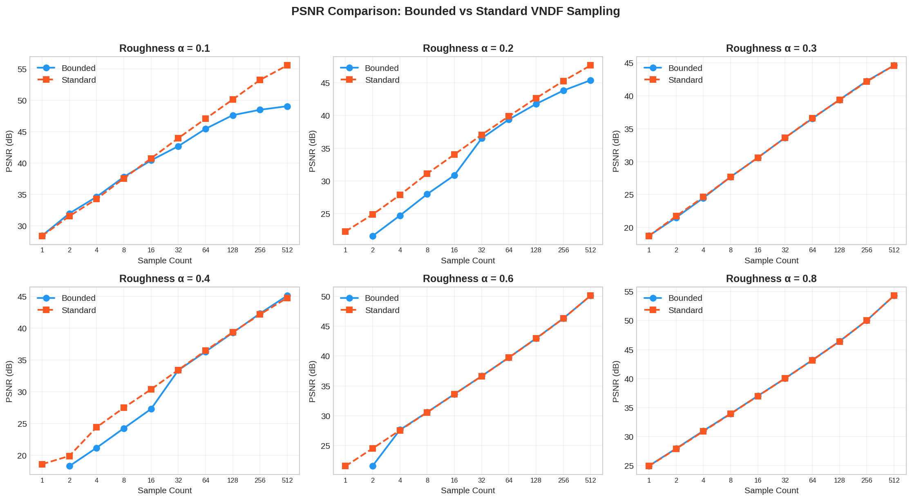
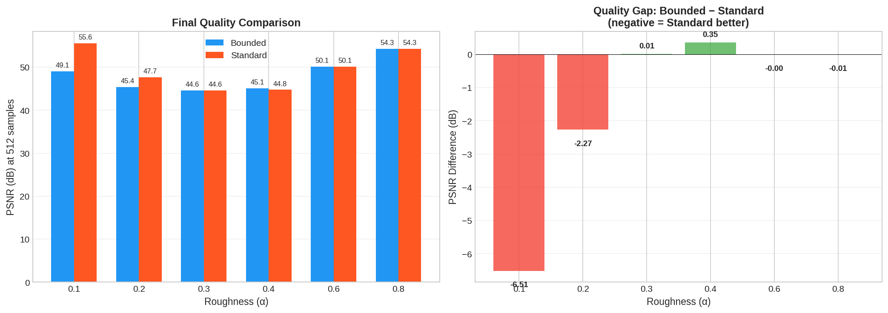

# VNDF Sampling Analysis: Bounded vs Standard

This analysis compares **Bounded VNDF** and **Standard VNDF** sampling methods for Smith-GGX microfacet BRDFs in path tracing.

## Overview

The main comparison shows four key metrics:
- **PSNR vs Sample Count** (top-left): Quality improvement with more samples across all roughness values
- **RMSE Convergence** (top-right): Error reduction follows expected √N rate on log scale
- **Render Time** (bottom-left): Both methods have nearly identical performance
- **Sampling Efficiency** (bottom-right): Quality per time, highest at low sample counts

## PSNR by Roughness

Individual breakdowns show distinct behavior patterns:
- **α=0.1**: Standard VNDF significantly outperforms Bounded at high sample counts
- **α=0.2**: Standard VNDF maintains advantage throughout
- **α=0.3**: Methods converge to similar results
- **α=0.4**: Bounded shows initial lag but catches up at high samples
- **α=0.6, 0.8**: Virtually identical performance

## Summary

**Final Quality at 512 Samples** (left):
| Roughness | Bounded | Standard |
|-----------|---------|----------|
| α=0.1 | 49.1 dB | 55.6 dB |
| α=0.2 | 45.4 dB | 47.7 dB |
| α=0.3 | 44.6 dB | 44.6 dB |
| α=0.4 | 45.1 dB | 44.8 dB |
| α=0.6 | 50.1 dB | 50.1 dB |
| α=0.8 | 54.3 dB | 54.3 dB |

**Quality Gap** (right): Negative values indicate Standard VNDF is better
- α=0.1: -6.51 dB (Standard wins)
- α=0.2: -2.27 dB (Standard wins)
- α=0.3: +0.01 dB (equivalent)
- α=0.4: +0.35 dB (Bounded slightly better)
- α=0.6: -0.00 dB (equivalent)
- α=0.8: -0.01 dB (equivalent)

## Detailed Heatmaps

**PSNR Difference** (left): Red indicates Standard VNDF performs better
- Low roughness (α=0.1-0.2): Standard dominates, especially at high sample counts
- Medium roughness (α=0.4): Bounded struggles at low samples (2-16 SPP)
- High roughness (α=0.6-0.8): Negligible differences

**Render Time Difference** (right): Green indicates Bounded is faster
- α=0.8: Bounded consistently faster by 8-16 ms
- α=0.1-0.2: Mixed results, Bounded slower at high sample counts

## Key Findings

1. **Standard VNDF excels at low roughness**: Up to 6.5 dB better at α=0.1, indicating the bounding approximation is less accurate for sharp specular reflections.

2. **Equivalent at high roughness**: For α ≥ 0.6, both methods produce identical results.

3. **Bounded has early convergence issues**: At α=0.4, Bounded shows 3+ dB deficit at low sample counts (2-16 SPP) before catching up.

4. **Negligible performance difference**: Render times are within ±15 ms across all configurations.

## Recommendation

| Roughness | Recommendation |
|-----------|----------------|
| α < 0.3 | **Standard VNDF** - Significant quality advantage |
| α = 0.3-0.4 | **Standard VNDF** - Better early convergence |
| α > 0.5 | Either - Identical performance |

**For general use**: Standard VNDF is recommended as the default, offering equivalent or better quality with no performance penalty.

## Test Configuration

- **Roughness values**: α = 0.1, 0.2, 0.3, 0.4, 0.6, 0.8
- **Sample counts**: 1, 2, 4, 8, 16, 32, 64, 128, 256, 512 SPP
- **Reference**: 4096 SPP ground truth

## Test Environment

- **Date**: December 6, 2025
- **Platform**: Windows (MSYS_NT-10.0)
- **Renderer**: MatForge Path Tracer
- **GPU**: Vulkan Ray Tracing Pipeline
